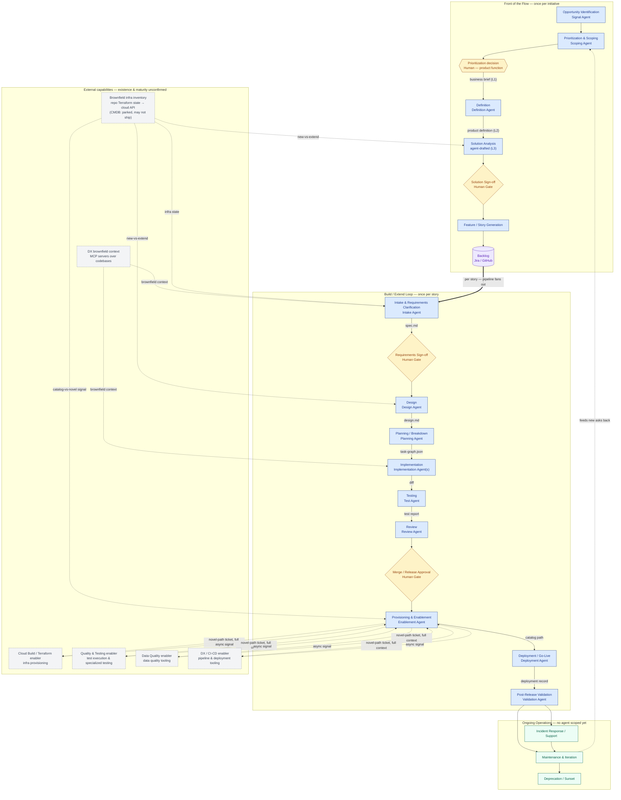

# Software Development — End-to-End Business Process Flow

*Process view: the full lifecycle from idea to sunset. The pipeline **fans out** — front-of-flow steps run once per initiative; the build loop runs once per story. Each step is annotated with its proposed agent. Everything the pipeline assumes exists elsewhere (sibling enablers, brownfield tooling) is called out individually rather than folded into one black-box assumption. Reasoning trail in [`../notes/platform-notes.md`](../notes/platform-notes.md). Working reference, not a finalized design — treat every agent assignment and autonomy tier below as a current working position.*

## Diagram

**Reading the diagram.** Two boxes, both this platform's own scope:

- **Front of the Flow** runs **once per initiative** — a business ask becomes a signed solution and a well-formed backlog. The [Definition Agent](../agents/definition-agent.md) owns the L1→L2 translation (business brief → product definition); [Solution Sign-off](../agents/solution-signoff-gate.md) is the human gate on architecture before any stories exist.
- **Build / Extend Loop** runs **once per story**, pulled off the backlog. The bold arrow is the fan-out point: one initiative produces N stories, each an independent run through Intake → Validation, inheriting the signed solution as a constraint boundary.

Solid arrows are synchronous control flow; the two boxes need nothing outside themselves to make sense. The dashed **External Capabilities** box is everything the pipeline *assumes* exists elsewhere but hasn't confirmed — every dashed connection is a dependency to validate individually (if it exists, wire to it as drawn; if not, it becomes a build item). **Ongoing Operations** is the post-build tail, not yet scoped.

## External Dependency Status

Fill this in as each capability is actually confirmed — the point of separating them out above is so this can be answered one row at a time rather than as one all-or-nothing assumption.

| Capability | Feeds | Assumed status | If confirmed missing |
|---|---|---|---|
| DX brownfield context (MCP servers over codebases) | Intake Agent, Implementation Agent(s) | Assumed to exist; maturity and integration effort not yet assessed | Intake and Implementation lose brownfield context — every ask is effectively treated as greenfield until this is built |
| Brownfield infra inventory (repo Terraform state → cloud-provider API cascade) | Intake Agent (current-state facts for NFRs), solution analysis + Design Agent (new-vs-extend decision), Enablement Agent (catalog-vs-novel signal) | **Decided (2026-09-04): scope stops at direct cloud-API query.** Repo-local Terraform state is checked first; if the ask's infra isn't covered there, query the cloud provider directly (e.g. AWS Config / Resource Explorer). A CMDB fallback is explicitly parked and may not ship at all — CMDB accuracy in practice is unconfirmed and untrustworthy enough that requiring one would block MVP scope on an unreliable system of record | If neither repo IaC nor a direct cloud-API query resolves it: same handling as a genuinely-unknown Intake gap — flagged `[unresolved]` and escalated to a human infra owner, never silently assumed greenfield. Design cannot pre-classify new-vs-extend work in that case |
| Cloud Build / Terraform enabler | Enablement Agent, novel path | Assumed to exist as a ticket-fulfilled team | Novel-path infra requests have nowhere to route — becomes a build item for this platform, or an escalation |
| Quality & Testing enabler | Enablement Agent, novel path — specialized testing categories (compliance, UAT, penetration testing) | Assumed to exist as a ticket-fulfilled team | Those testing categories have no home; either the Test Agent's scope expands or this becomes a build item |
| Data Quality enabler | Enablement Agent, novel path | Assumed to exist as a ticket-fulfilled team | Data quality tooling becomes a build item |
| DX / CI-CD enabler | Enablement Agent, novel path; execution consumed by Deployment Agent | Assumed to exist as a ticket-fulfilled team | Deployment Agent has no pipeline to execute against — likely the highest-priority gap, since nothing ships without it |

## Step Reference

Full per-step detail — purpose, inputs/outputs, autonomy, handoffs — is in [`../agents/`](../agents/) (see its [README](../agents/README.md) for the ordered list). Summary:

| Segment | Step | Agent / Gate |
|---|------|--------------|
| Front of flow · per initiative | Opportunity Identification | [Signal Agent](../agents/signal-agent.md) |
| Front of flow · per initiative | Prioritization & Scoping | [Scoping Agent](../agents/scoping-agent.md) |
| Front of flow · per initiative | Prioritization decision | Human — product function |
| Front of flow · per initiative | Definition (L1→L2) | [Definition Agent](../agents/definition-agent.md) |
| Front of flow · per initiative | Solution analysis (L2→L3) | *agent, not yet specced* |
| Front of flow · per initiative | Solution Sign-off | [Human Gate](../agents/solution-signoff-gate.md) |
| Front of flow · per initiative | Feature / story generation | *agent, not yet specced* |
| Build loop · per story | Intake & Requirements Clarification | [Intake Agent](../agents/intake-agent.md) |
| Build loop · per story | Requirements Sign-off | [Human Gate](../agents/requirements-signoff-gate.md) |
| Build loop · per story | Design | [Design Agent](../agents/design-agent.md) |
| Build loop · per story | Planning / Breakdown | [Planning Agent](../agents/planning-agent.md) |
| Build loop · per story | Implementation | [Implementation Agent(s)](../agents/implementation-agent.md) |
| Build loop · per story | Testing | [Test Agent](../agents/test-agent.md) |
| Build loop · per story | Review | [Review Agent](../agents/review-agent.md) |
| Build loop · per story | Merge / Release Approval | [Human Gate](../agents/merge-release-approval-gate.md) |
| Build loop · per story | Provisioning & Enablement | [Enablement Agent](../agents/enablement-agent.md) |
| Build loop · per story | Deployment / Go-Live | [Deployment Agent](../agents/deployment-agent.md) |
| Build loop · per story | Post-Release Validation & Monitoring | [Validation Agent](../agents/validation-agent.md) |
| Ongoing operations | Incident Response · Maintenance · Deprecation | *not yet scoped* |

## Autonomy Tiering Framework

**Moved.** The canonical statement of the Known/Unknown × Safe/Risky model — the 2×2, the opposite handling of the two mixed quadrants, and the task-graph-node granularity rule — now lives in [`../policies/autonomy-tiering.md`](../policies/autonomy-tiering.md). Each agent's sub-doc works out what "known," "safe," "unknown," and "risky" mean concretely for that step.

## Requirement Change Management

> **Refined thinking on this topic lives in [`requirement-change-handling.md`](../policies/requirement-change-handling.md)** (v0.5) — it adds dimensions beyond blast radius (timing, reversibility, urgency), replaces the halt-vs-continue binary with a three-response model, and works through how agentic execution changes the calculus. The policy below is the earlier single-story version, kept here until that thinking is integrated.

`spec.md` is the pipeline's source of truth, but that only means something if there's a defined answer to what happens when it changes — which nothing above addresses yet. Requirements changing mid-pipeline is common in practice, not an edge case, so this needs an explicit policy rather than an implicit one.

**Versioning.** Any proposed change to `spec.md` after the Requirements Sign-off gate is a change request, not a silent edit. The spec is versioned (`spec.md@v2`, not an overwrite of `v1`), and every downstream artifact (`design.md`, `task-graph.json`, diffs, test reports) records which spec version it was built against — so drift is always detectable rather than discovered later.

**Classifying the change.** The change is routed by blast radius back through the pipeline it's already part of, not handled as a separate process:

- **Clarification — no re-approval needed.** Resolves ambiguity without altering behavior or acceptance criteria (e.g., specifying a previously-unstated default). The Intake Agent applies this autonomously and logs it; no gate re-triggers.
- **Additive/isolated — partial re-entry.** Adds a new acceptance criterion or constraint that doesn't invalidate work already done. Re-enters at Requirements Sign-off for fast re-approval, then flows forward; work already completed against unaffected task-graph nodes doesn't restart, per the same dependency-decomposition logic used elsewhere in this doc.
- **Material — restart from Design.** Alters the data model, an existing acceptance criterion, or a non-functional requirement in a way that could invalidate design decisions already made. Re-enters at Requirements Sign-off, and on approval restarts at Design for affected nodes only — unaffected task-graph branches are not redone.
- **Fundamental — restart from Scoping.** Alters what's being built at a level that calls the original prioritization into question. Re-enters at Prioritization & Scoping, effectively treated as a new ask that shares history with the old one.

**Who decides the classification.** The Intake Agent proposes a classification with its reasoning (what changed, what it invalidates); the human at the relevant re-approval gate confirms or overrides it. This keeps classification itself inside the autonomy framework above — a clear-cut clarification is Known+Safe and agent-classified without friction, while an ambiguous case defaults to a human call rather than the agent guessing at its own blast radius.

**Downstream of merge.** A requirement gap discovered *after* release is not a change request against the same spec — it's a new opportunity or incident, entering at Opportunity Identification or Incident Response depending on whether it's a missed requirement or a production defect. The spec that shipped stays the historical record of what was actually approved and built.

## Front of the Flow

The front section — now reflected in the diagram above — is worked out in detail in [`front-of-flow.md`](front-of-flow.md). Key points:

- **Requirement levels (L1–L4).** Business / product / architect / senior-dev precision levels; each requirement is tagged with its level so the system knows how much translation is needed and who signs off. Translation is bidirectional (the diagram shows the downward path).
- **Artifact chain.** Business brief (L1) → product definition (L2, validated back with the business) → solution spec (L3) → story specs. Derived and versioned, not hand-maintained parallel docs — see [`data-model.md`](data-model.md).
- **Definition Agent (L1→L2).** Owns the mirror-back (stakeholder-signed) plus product-introduced requirements / NFRs / targets / feature-breakout (product-attested). Spec: [`../agents/definition-agent.md`](../agents/definition-agent.md); the 13 phase decisions: [`../decisions/log.md`](../decisions/log.md#product-definition-phase-2026-09-05).
- **Initiative → Feature → Story hierarchy.** Feature is the unit of merge. The high-level solution is agent-drafted and human-signed *before* story breakdown — the **third human gate** ([Solution Sign-off](../agents/solution-signoff-gate.md)), alongside Requirements Sign-off and Merge / Release Approval.
- **Fan-out.** Front-of-flow steps plus solution analysis run per initiative; the build loop (Intake → Validation) runs per story. The Design step becomes per-story elaboration *within* the signed solution, not where architecture is first decided.

Still pending: merge/release mechanics (branch strategy, how story work rolls up to a feature, whether the merge gate splits into feature-merge and release gates) — see [`../decisions/open-questions.md`](../decisions/open-questions.md).

## Agent & Gate Directory

See [`../agents/README.md`](../agents/README.md) for the ordered directory with types and one-line transforms.

---

*Doc status: working reference, not reviewed or approved by anyone else. Agent assignments and autonomy tiers are proposals to challenge, not commitments. Diagram updated 2026-09-05 to show the front-of-flow fan-out; solution-analysis and story-generation agents are named but not yet specced.*
