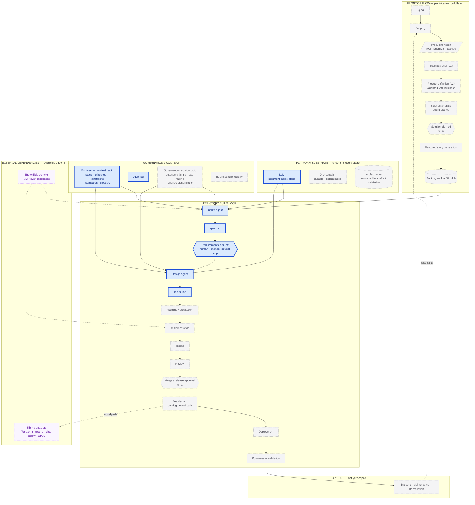

# Architecture — Back of Napkin

*Working sketch, 2026-09-04. Major components of the platform on one page, with the MVP scope highlighted against the full system. Deliberately rough — it collapses detail that the other thinking docs carry. Companion to [`platform-notes.md`](platform-notes.md); the rigorous process view is in [`process-flow.md`](../architecture/process-flow.md).*

## Diagram

## Reading guide

**Blue, bold = MVP.** Intake agent → `spec.md` → requirements sign-off (change-request loop, no direct human edits) → Design agent → `design.md`. Plus the LLM doing the judgment, the engineering-context pack it reads, and the ADR log. Single reviewer, greenfield, GitHub issue in / docs out. Runs as a skill or prompt-loop.

**Grey, dashed = full system, built later.** The whole front of flow (v0.5), the rest of the build loop (planning through validation), the ops tail, and the heavier substrate — durable orchestration and a real artifact store rather than git files.

**Purple, dashed = external, existence unconfirmed.** Brownfield MCP context and the four sibling enablers. Every one is a row in the External Dependency Status table that still needs checking against reality.

**Nuances the colour can't show:**
- `Governance decision logic` and `Artifact store` exist in the MVP in a minimal form — pure functions for the first, git for the second — behind a clean interface, to be swapped for real components later ([`rules-and-policy.md`](../policies/rules-and-policy.md)).
- The MVP Design agent already does consumer-side validation of `spec.md` on input — the first instance of handoff validation.
- `Product function` may be a human or an agent; it is largely outside platform scope either way.

*Status: sketch, 2026-09-04. Regenerate when the front-of-flow fan-out or the substrate choices firm up.*
