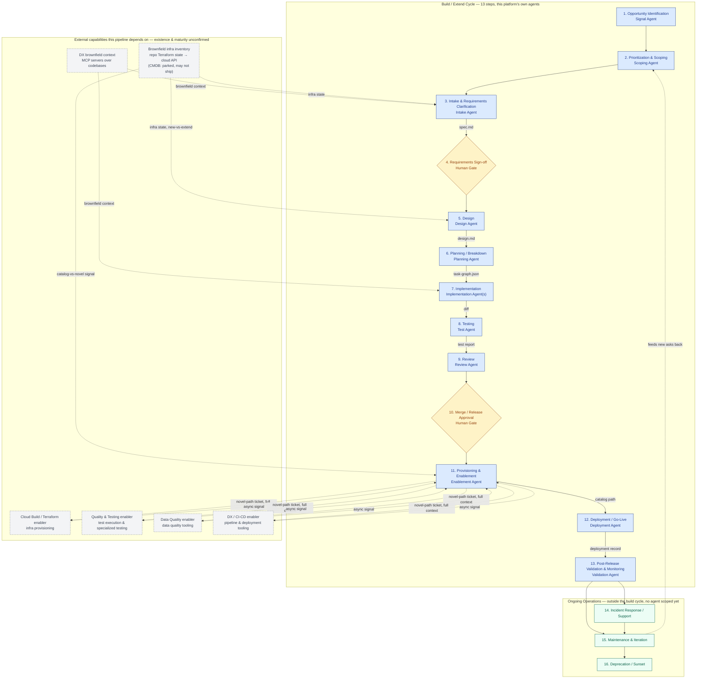

# Software Development — End-to-End Business Process Flow

*Process view: the full lifecycle from idea to sunset, with the 13-step build/extend cycle segregated from ongoing operations, and each step annotated with its proposed agent (where one exists). This is now the single architecture diagram for the platform, rooted in the business process rather than split from a separate orchestration-engine view — the agent pipeline is self-contained, and everything it currently assumes exists elsewhere (sibling enablers, brownfield tooling) is called out individually rather than folded into one black-box assumption. Derived from \`vibeengineeringplatformnotes.md\`, extended through iterative discussion. This is a working reference, not a finalized design — treat every agent assignment and autonomy tier below as a current working position.*

## Diagram

**Reading the diagram:** this is now the single architecture diagram, rooted in the business process rather than split from a separate orchestration-engine view. The boxed **Build / Extend Cycle** is entirely this platform's own scope — the 13 agent/gate steps, with the durable artifacts each hands to the next (\`spec.md\`, \`design.md\`, \`task-graph.json\`, diff, test report, deployment record). Solid arrows inside it are synchronous control flow, and the diagram doesn't require anything outside itself to make sense. The dashed **External Capabilities** box is everything the pipeline currently *assumes* exists elsewhere — sibling enablers and brownfield tooling — but hasn't confirmed. Every dashed connection into or out of that box is a dependency worth validating individually: if a capability turns out to already exist, wire the agent to it as drawn; if it doesn't, that capability becomes a build item for this platform, not a given. The **Ongoing Operations** box is the post-build lifecycle tail, unchanged from before.

## External Dependency Status

Fill this in as each capability is actually confirmed — the point of separating them out above is so this can be answered one row at a time rather than as one all-or-nothing assumption.

| Capability | Feeds | Assumed status | If confirmed missing |
|---|---|---|---|
| DX brownfield context (MCP servers over codebases) | Intake Agent (3), Implementation Agent(s) (7) | Assumed to exist; maturity and integration effort not yet assessed | Intake and Implementation lose brownfield context — every ask is effectively treated as greenfield until this is built |
| Brownfield infra inventory (repo Terraform state → cloud-provider API cascade) | Intake Agent (3, current-state facts for NFRs), Design Agent (5, new-vs-extend decision), Enablement Agent (11, catalog-vs-novel signal) | **Decided (2026-09-04): scope stops at direct cloud-API query.** Repo-local Terraform state is checked first; if the ask's infra isn't covered there, query the cloud provider directly (e.g. AWS Config / Resource Explorer). A CMDB fallback is explicitly parked and may not ship at all — CMDB accuracy in practice is unconfirmed and untrustworthy enough that requiring one would block MVP scope on an unreliable system of record | If neither repo IaC nor a direct cloud-API query resolves it: same handling as a genuinely-unknown Intake gap — flagged `[unresolved]` and escalated to a human infra owner, never silently assumed greenfield. Design cannot pre-classify new-vs-extend work in that case |
| Cloud Build / Terraform enabler | Enablement Agent (11), novel path | Assumed to exist as a ticket-fulfilled team | Novel-path infra requests have nowhere to route — becomes a build item for this platform, or an escalation |
| Quality & Testing enabler | Enablement Agent (11), novel path — specialized testing categories (compliance, UAT, penetration testing) | Assumed to exist as a ticket-fulfilled team | Those testing categories have no home; either the Test Agent's scope expands or this becomes a build item |
| Data Quality enabler | Enablement Agent (11), novel path | Assumed to exist as a ticket-fulfilled team | Data quality tooling becomes a build item |
| DX / CI-CD enabler | Enablement Agent (11), novel path; execution consumed by Deployment Agent (12) | Assumed to exist as a ticket-fulfilled team | Deployment Agent has no pipeline to execute against — likely the highest-priority gap, since nothing ships without it |

## Step Reference

| # | Step | Segment | Agent / Gate | Detail |
|---|------|---------|---------------|--------|
| 1 | Opportunity Identification | Build cycle | Signal Agent | [→](agents/01-signal-agent.md) |
| 2 | Prioritization & Scoping | Build cycle | Scoping Agent | [→](agents/02-scoping-agent.md) |
| 3 | Intake & Requirements Clarification | Build cycle | Intake Agent | [→](agents/03-intake-agent.md) |
| 4 | Requirements Sign-off | Build cycle | Human Gate | [→](agents/04-requirements-signoff-gate.md) |
| 5 | Design | Build cycle | Design Agent | [→](agents/05-design-agent.md) |
| 6 | Planning / Breakdown | Build cycle | Planning Agent | [→](agents/06-planning-agent.md) |
| 7 | Implementation | Build cycle | Implementation Agent(s) | [→](agents/07-implementation-agent.md) |
| 8 | Testing | Build cycle | Test Agent | [→](agents/08-test-agent.md) |
| 9 | Review | Build cycle | Review Agent | [→](agents/09-review-agent.md) |
| 10 | Merge / Release Approval | Build cycle | Human Gate | [→](agents/10-merge-release-approval-gate.md) |
| 11 | Provisioning & Enablement | Build cycle | Enablement Agent | [→](agents/11-enablement-agent.md) |
| 12 | Deployment / Go-Live | Build cycle | Deployment Agent | [→](agents/12-deployment-agent.md) |
| 13 | Post-Release Validation & Monitoring | Build cycle | Validation Agent | [→](agents/13-validation-agent.md) |
| 14 | Incident Response / Support | Ongoing operations | *not yet scoped* | — |
| 15 | Maintenance & Iteration | Ongoing operations | *not yet scoped* | — |
| 16 | Deprecation / Sunset | Ongoing operations | *not yet scoped* | — |

## Autonomy Tiering Framework

Each agent's authority to act on its own is governed by two independent axes, not one:

- **Is the path known?** — has this exact (or close enough) pattern been done before, with an established, reviewed precedent (an approved Terraform module, a standard test suite, a familiar architectural pattern)?
- **Is it safe?** — regardless of precedent, what's the blast radius if the agent is wrong, and how easily is it reversed?

That produces a 2×2, not a simple ladder — and the two mixed quadrants need *opposite* handling, not identical "partial autonomy":

| | **Safe** | **Risky** |
|---|---|---|
| **Known** | **Full autonomy.** Execute directly. | **Autonomous prep, human-gated execution.** The agent drafts and stages the full change, but a human approves before it goes live — not because the agent is uncertain, but because the cost of being wrong is high enough to warrant a second set of eyes regardless of confidence. |
| **Unknown** | **Autonomous execution, human audit after.** The agent acts, and review happens as an audit rather than a gate, because mistakes here are cheap to catch and cheap to undo. | **Manual.** Default to a human; the agent assists (drafting, summarizing, prepping) but does not act. |

**Granularity matters more than the tier itself.** The right unit of autonomy is the task-graph node, not the whole request. A change that's 90% known-safe and 10% novel shouldn't wait on a human for the whole thing — everything whose dependency closure doesn't touch the novel piece should proceed autonomously, while only the novel node (and anything downstream of it) routes to a human. This applies across every agent below, not just Enablement, where it was first identified: Implementation can build the known-safe branches of a task graph while a novel branch is gated; Testing can run standard suites autonomously while flagging only the genuinely new code path for closer review.

Each agent's sub-doc below works out what "known," "safe," "unknown," and "risky" concretely mean for that step.

## Requirement Change Management

> **Refined thinking on this topic lives in [`requirement-change-handling.md`](requirement-change-handling.md)** (v0.5) — it adds dimensions beyond blast radius (timing, reversibility, urgency), replaces the halt-vs-continue binary with a three-response model, and works through how agentic execution changes the calculus. The policy below is the earlier single-story version, kept here until that thinking is integrated.

`spec.md` is the pipeline's source of truth, but that only means something if there's a defined answer to what happens when it changes — which nothing above addresses yet. Requirements changing mid-pipeline is common in practice, not an edge case, so this needs an explicit policy rather than an implicit one.

**Versioning.** Any proposed change to `spec.md` after the Requirements Sign-off gate (step 4) is a change request, not a silent edit. The spec is versioned (`spec.md@v2`, not an overwrite of `v1`), and every downstream artifact (`design.md`, `task-graph.json`, diffs, test reports) records which spec version it was built against — so drift is always detectable rather than discovered later.

**Classifying the change.** The change is routed by blast radius back through the pipeline it's already part of, not handled as a separate process:

- **Clarification — no re-approval needed.** Resolves ambiguity without altering behavior or acceptance criteria (e.g., specifying a previously-unstated default). The Intake Agent applies this autonomously and logs it; no gate re-triggers.
- **Additive/isolated — partial re-entry.** Adds a new acceptance criterion or constraint that doesn't invalidate work already done. Re-enters at Requirements Sign-off (step 4) for fast re-approval, then flows forward; work already completed against unaffected task-graph nodes doesn't restart, per the same dependency-decomposition logic used elsewhere in this doc.
- **Material — restart from Design.** Alters the data model, an existing acceptance criterion, or a non-functional requirement in a way that could invalidate design decisions already made. Re-enters at step 4, and on approval restarts at Design (step 5) for affected nodes only — unaffected task-graph branches are not redone.
- **Fundamental — restart from Scoping.** Alters what's being built at a level that calls the original prioritization into question. Re-enters at Prioritization & Scoping (step 2), effectively treated as a new ask that shares history with the old one.

**Who decides the classification.** The Intake Agent proposes a classification with its reasoning (what changed, what it invalidates); the human at the relevant re-approval gate confirms or overrides it. This keeps classification itself inside the autonomy framework above — a clear-cut clarification is Known+Safe and agent-classified without friction, while an ambiguous case defaults to a human call rather than the agent guessing at its own blast radius.

**Downstream of merge.** A requirement gap discovered *after* release (step 12+) is not a change request against the same spec — it's a new opportunity or incident, entering at step 1 (Opportunity Identification) or step 14 (Incident Response) depending on whether it's a missed requirement or a production defect. The spec that shipped stays the historical record of what was actually approved and built.

## Front of the Flow (v0.5 evolution — not yet reflected in the diagram above)

The diagram treats "an ask" as a single unit flowing from Scoping (step 2) straight into per-story Intake (step 3). [`front-of-flow.md`](front-of-flow.md) works out a richer front section that isn't drawn here yet:

- **Requirement levels (L1–L4).** Business / product / architect / senior-dev precision levels; each requirement is tagged with its level so the system knows how much translation is needed and who signs off. Translation is bidirectional (the diagram only shows downward).
- **Artifact chain.** Business brief (L1) → product definition (L2, validated back with the business) → solution spec (L3, initiative and/or feature) → story specs. Derived and versioned, not hand-maintained parallel docs.
- **Definition Agent (L1→L2).** The product-definition phase now has a specced agent — [`agents/definition-agent.md`](agents/definition-agent.md) — sitting between Scoping (2) and per-story Intake (3). It owns the mirror-back (stakeholder-signed) plus product-introduced requirements/NFRs/targets/feature-breakout (product-attested). Phase decisions: [`product-definition-phase-open-questions.md`](product-definition-phase-open-questions.md). Enterprise-tooling integration options: [`product-definition-integration-options.md`](product-definition-integration-options.md).
- **Initiative → Feature → Story hierarchy.** Feature is the unit of merge. A high-level solution is agent-drafted and human-signed *before* story breakdown — a **third human gate**, alongside Requirements Sign-off (4) and Merge / Release Approval (10).
- **Fan-out.** Steps 1–2 plus solution analysis run per initiative (and per feature); steps 3–13 run per story. The existing Design step (5) becomes per-story/per-feature elaboration *within* the signed solution.

Integrating this into the diagram, the step reference table, and the per-agent docs is pending — it needs the merge/release questions resolved first (see the follow-up list in `front-of-flow.md`).

## Agent & Gate Directory

| Agent / Gate | Pipeline Step | Type |
|---|---|---|
| [Signal Agent](agents/01-signal-agent.md) | 1. Opportunity Identification | Agent |
| [Scoping Agent](agents/02-scoping-agent.md) | 2. Prioritization & Scoping | Agent |
| [Definition Agent](agents/definition-agent.md) | Front-of-flow: L1→L2 product definition (v0.5, not yet numbered) | Agent |
| [Intake Agent](agents/03-intake-agent.md) | 3. Intake & Requirements Clarification | Agent |
| [Requirements Sign-off Gate](agents/04-requirements-signoff-gate.md) | 4. Requirements Sign-off | Human Gate |
| [Design Agent](agents/05-design-agent.md) | 5. Design | Agent |
| [Planning Agent](agents/06-planning-agent.md) | 6. Planning / Breakdown | Agent |
| [Implementation Agent(s)](agents/07-implementation-agent.md) | 7. Implementation | Agent |
| [Test Agent](agents/08-test-agent.md) | 8. Testing | Agent |
| [Review Agent](agents/09-review-agent.md) | 9. Review | Agent |
| [Merge & Release Approval Gate](agents/10-merge-release-approval-gate.md) | 10. Merge / Release Approval | Human Gate |
| [Enablement Agent](agents/11-enablement-agent.md) | 11. Provisioning & Enablement | Agent (bifurcated: catalog path / novel path) |
| [Deployment Agent](agents/12-deployment-agent.md) | 12. Deployment / Go-Live | Agent |
| [Validation Agent](agents/13-validation-agent.md) | 13. Post-Release Validation & Monitoring | Agent |

---

*Doc status: working notes built up over an iterative conversation, not reviewed or approved by anyone else. Agent assignments and autonomy tiers are proposals to challenge, not commitments — the most useful next step is probably to stress-test one agent's tiering against a real historical change, or to scope the three Ongoing Operations steps the same way the build cycle was scoped here.*
